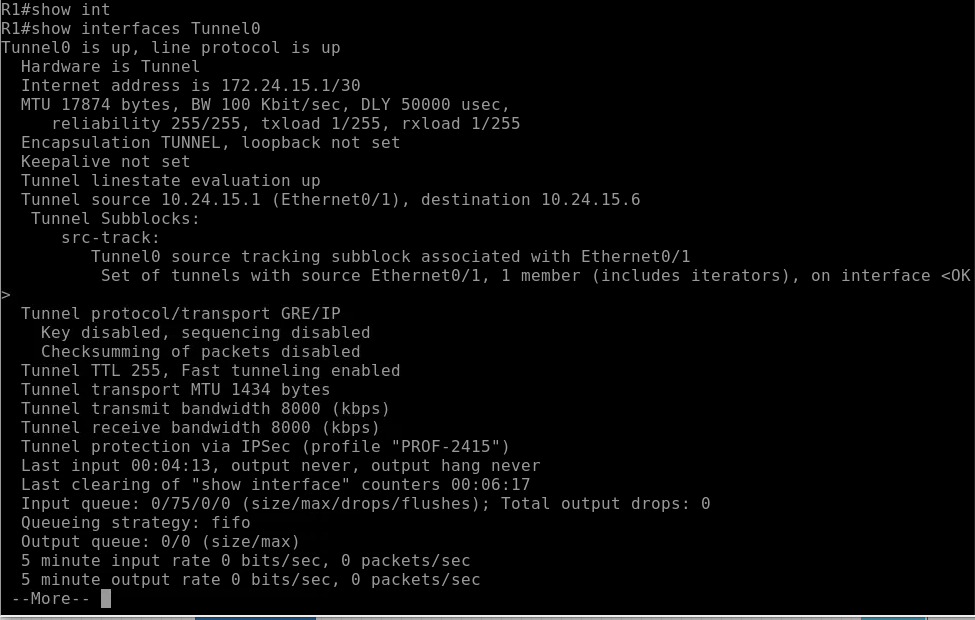
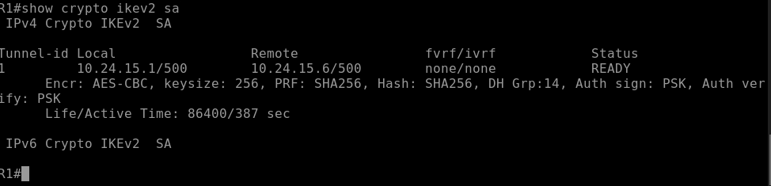
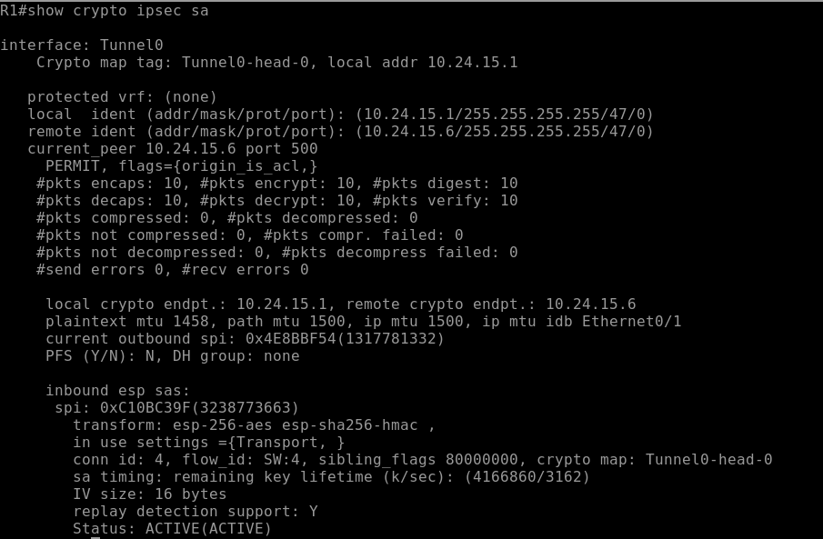
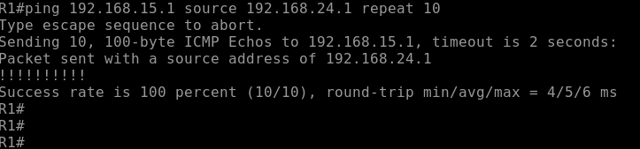

# VPN Site-to-Site IPSec IKEv2 GRE Tunnel

**Estudiante:** Edwin De Paula  
**Matricula:** 2024-2415  
**Institución:** Instituto Tecnológico de las Américas (ITLA)  
**Asignatura:** Seguridad en Redes

---

## Video

| Recurso | URL |
|---|---|
| Video YouTube | _pendiente_ |

---

## Objetivo

Implementar una VPN Site-to-Site utilizando un túnel GRE explícito cifrado con IPSec IKEv2 entre dos sitios remotos a través de un router ISP. Este lab combina el protocolo de tunelización GRE con la seguridad mejorada de IKEv2, usando modo Transport en IPSec ya que GRE se encarga de la encapsulación completa del paquete.

---

## Topología


| Dispositivo | Interfaz | Dirección IP | Descripción |
|---|---|---|---|
| R1 | Ethernet0/0 | 192.168.24.1/24 | LAN Site A |
| R1 | Ethernet0/1 | 10.24.15.1/30 | WAN hacia ISP |
| R1 | Tunnel0 | 172.24.15.1/30 | Túnel GRE virtual |
| ISP | Ethernet0/0 | 10.24.15.2/30 | WAN hacia R1 |
| ISP | Ethernet0/1 | 10.24.15.5/30 | WAN hacia R2 |
| R2 | Ethernet0/0 | 10.24.15.6/30 | WAN hacia ISP |
| R2 | Ethernet0/1 | 192.168.15.1/24 | LAN Site B |
| R2 | Tunnel0 | 172.24.15.2/30 | Túnel GRE virtual |
| PC-A | eth0 | 192.168.24.10/24 | Gateway: 192.168.24.1 |
| PC-B | eth0 | 192.168.15.10/24 | Gateway: 192.168.15.1 |

---

## Parámetros de Configuración

### IKEv2 Proposal

| Parámetro | Valor |
|---|---|
| Nombre | PROP-2415 |
| Cifrado | AES-CBC-256 |
| Integridad | SHA-256 |
| Grupo Diffie-Hellman | Grupo 14 (2048 bits) |

### IKEv2 Keyring y Profile

| Parámetro | Valor |
|---|---|
| Keyring | KR-2415 |
| Pre-shared Key | Edwin2024 |
| Profile | IKEV2-PROF-2415 |
| Autenticación local | Pre-shared Key |
| Autenticación remota | Pre-shared Key |

### Fase 2 - IPSec

| Parámetro | Valor |
|---|---|
| Transform Set | TS-2415 |
| Protocolo | ESP |
| Cifrado | AES 256 |
| Integridad | SHA-256 HMAC |
| Modo | **Transport** (no Tunnel) |
| IPSec Profile | PROF-2415 |
| IKEv2 Profile en PROF-2415 | IKEV2-PROF-2415 |

### GRE Tunnel

| Parámetro | Valor |
|---|---|
| Modo del túnel | GRE/IP explícito |
| Interfaz Tunnel R1 | Tunnel0 — 172.24.15.1/30 |
| Interfaz Tunnel R2 | Tunnel0 — 172.24.15.2/30 |
| Tunnel Source R1 | Ethernet0/1 (10.24.15.1) |
| Tunnel Source R2 | Ethernet0/0 (10.24.15.6) |
| Tunnel Destination R1 | 10.24.15.6 |
| Tunnel Destination R2 | 10.24.15.1 |

---

## Explicación de la Configuración

### GRE over IPSec con IKEv2

Este lab es la evolución del Lab 3 (GRE over IKEv1) usando IKEv2 como protocolo de negociación. GRE crea el túnel virtual y se encarga de encapsular el paquete IP completo. IPSec cifra el payload GRE en modo Transport — no necesita agregar un header adicional porque GRE ya lo hace.

### Diferencia con Lab 3 (GRE over IKEv1)

| Aspecto | Lab 3 — IKEv1 | Lab 6 — IKEv2 |
|---|---|---|
| Negociación | `crypto isakmp policy` | `crypto ikev2 proposal/policy/keyring/profile` |
| Modo GRE | `tunnel mode gre ip` | `tunnel mode gre ip` |
| Modo IPSec | Transport | Transport |
| IPSec Profile | Solo transform set | Transform set + IKEv2 profile |

### Diferencia con Lab 5 (IKEv2 Route-Based)

| Aspecto | Lab 5 — Route-Based | Lab 6 — GRE Tunnel |
|---|---|---|
| Modo GRE | Implícito (default) | Explícito `tunnel mode gre ip` |
| Modo IPSec | Tunnel | **Transport** |
| Overhead | Mayor | Menor |

### Flujo de Negociación

1. PC-A genera tráfico hacia 192.168.15.0/24
2. R1 consulta la tabla de ruteo — apunta a Tunnel0 via 172.24.15.2
3. El tráfico es encapsulado por GRE dentro de Tunnel0
4. IPSec cifra el paquete GRE en modo Transport usando IKEv2
5. R1 negocia IKEv2 con R2 — intercambio de 4 mensajes
6. El tráfico GRE cifrado viaja a través del ISP hasta R2

---

## Verificación

### Interfaz Tunnel0

```
show interfaces Tunnel0
```



`Tunnel0 is up/up`, `Tunnel protocol/transport GRE/IP` confirma el modo GRE explícito, y `Tunnel protection via IPSec (profile "PROF-2415")` confirma el cifrado IKEv2 aplicado.

### IKEv2 SA

```
show crypto ikev2 sa
```



Estado `READY` con parámetros AES-CBC-256, SHA256, grupo DH 14 y PSK confirmados en ambas direcciones.

### IPSec SA - Fase 2

```
show crypto ipsec sa
```



El campo `in use settings ={Transport, }` confirma que IPSec opera en modo Transport sobre el túnel GRE. Status `ACTIVE(ACTIVE)` en ambas direcciones.

### Prueba de Conectividad

```
ping 192.168.15.1 source 192.168.24.1 repeat 10
```



100% de success rate confirma el correcto funcionamiento end-to-end de la VPN GRE over IPSec IKEv2.

---

## Archivos del Repositorio

```
ipsec-ikev2-gre-tunnel/
├── configs/
│   ├── R1.txt
│   ├── ISP.txt
│   └── R2.txt
├── docs/
│   └── screenshots/
│       ├── topology.png
│       ├── tunnel-interface.png
│       ├── ikev2-sa.png
│       ├── ipsec-sa.png
│       └── ping-test.png
└── README.md
```

---

## Herramientas Utilizadas

- PNetLab — Plataforma de emulación de red
- Cisco IOSv 15.4(2)T4 — Imagen de router emulado
- VMware — Virtualización del servidor PNetLab
